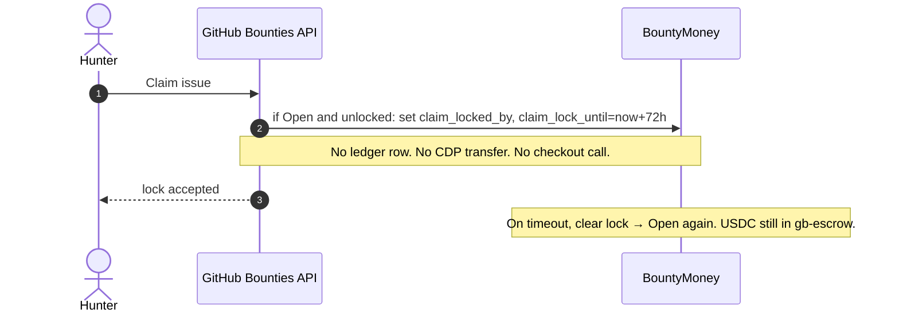

# ADR 0001: CDP wallets + x402 for USDC escrow (2% platform fee)

- **Status:** Accepted — product sign-off on [PR #1](https://github.com/jegamboafuentes/github-bounties/pull/1) (2026-09-09)
- **Date:** 2026-09-09
- **Product:** GitHub Bounties (not Lightning Bounties / LB1 / “Lightning Bounties 2”)
- **Ticket:** V0-A
- **GCP project:** `github-bounties` / `133702056111`

> **Accepted** — still no prod-wire of escrow into product UI until V1 tickets;
> Secret Manager + Sepolia dry-run OK when credentials exist. No real USDC mainnet
> spend. No production user funds.

## Context

GitHub Bounties pays hunters in USDC when a funded GitHub issue is merged. V0-A must
de-risk the money path before product UI:

1. A maintainer **funds** a bounty at face value `F` USDC.
2. Funds **sit in escrow** until merge, expiry, or cancel.
3. V1 **claim-lock** is a 72-hour exclusive coordination lock. **It must not move money.**
4. On merge, release **net of a 2% platform fee**. On expiry/cancel, **refund the funder**.
5. Rail is **Coinbase Developer Platform (CDP) wallets + x402** on Base (testnet first).
   Not Lightning. Not Solana/Circle/Firebase designs from other products.

Constraints that drove the shape:

| Constraint | Why it matters |
| --- | --- |
| Bounty lifetime is days–weeks | Coinbase Business Checkouts auto-capture after pay and default unpaid expiry is 24h. They are **not** long-lived escrow. |
| Face value must be conserved | x402 `exact` to a CDP `payTo` address lands USDC 1:1 (facilitator fee is billed to the CDP project, not taken from the transfer). Hosted checkout `settlement.feeAmount` **may** skim a merchant fee — confirm before treating checkout `COMPLETED` as “escrow has `F`”. |
| Humans and agents both fund | Hosted checkout gives humans a URL. The same checkout can expose `x402_url` for agents (**sandbox checkouts currently omit `x402_url`** — documented below). |
| No prod user funds | This environment has **no CDP secrets**. Live fund→release is blocked until Secret Manager is populated. |

### What x402 is (and is not)

x402 is an HTTP payment handshake: client requests a resource → `402 Payment Required` →
client retries with a signed USDC authorization → facilitator verifies and settles.

It is **not** a bounty state machine. We use it to **collect** USDC into an address we
control. We use **CDP server wallets + our ledger** to **hold, split, refund, and reconcile**.

Sources (fetched 2026-09-09):

- [How x402 works](https://docs.cdp.coinbase.com/x402/how-it-works)
- [Accept agentic payments with x402 (Checkouts)](https://docs.cdp.coinbase.com/coinbase-business/checkout-apis/accept-x402-payments)
- [Checkouts API](https://docs.cdp.coinbase.com/api-reference/business-api/rest-api/checkouts/introduction)
- [CDP Facilitator](https://docs.cdp.coinbase.com/x402/seller/facilitator)
- [Seller production configuration (`payTo`, schemes)](https://docs.cdp.coinbase.com/x402/seller/production-configuration)
- [CDP SDK client env vars](https://docs.cdp.coinbase.com/sdks/cdp-sdks-v2/typescript/client/cdp-client)
- [Idempotency (`X-Idempotency-Key`, UUID v4, 24h)](https://docs.cdp.coinbase.com/api-reference/v2/idempotency)
- [Create EVM account (name 2–36 chars, `[A-Za-z0-9-]`)](https://docs.cdp.coinbase.com/api-reference/v2/rest-api/evm-accounts/create-evm-account)
- [Faucets (Base Sepolia USDC)](https://docs.cdp.coinbase.com/faucets/introduction/welcome)

## Decision

**Hybrid inbound + CDP-wallet escrow. Fee at settlement. Pooled named wallets + ledger.**

### Integration shape (chosen)

| Leg | Choice | Why |
| --- | --- | --- |
| **Hold / release / refund** | CDP API-key **server EVM wallets** on Base | Long-lived, programmable, no checkout expiry. Keys stay in CDP TEE; we store `CDP_WALLET_SECRET`, not a raw private key. |
| **Human fund (preferred UX)** | Coinbase Business **hosted checkout** `url` | Shortens V1: Coinbase hosts wallet-connect + gasless USDC auth. Single-use checkout per fund attempt. |
| **Agent / programmatic fund** | Checkout `x402_url` (`auth-capture`) when present; otherwise our own x402 **`exact`** seller route with `payTo` = escrow | Same handshake, two sellers. `CdpX402Client` speaks `exact` only and **cannot** pay checkout `auth-capture` — use `AuthCaptureEvmScheme` for checkouts. |
| **Fallback human fund** | Direct USDC transfer to the escrow address | Works with any Base wallet if Business Checkouts is unavailable or net proceeds ≠ face. |
| **Fee** | `fee_atomic = floor(F * 2 / 100)`; hunter gets remainder | Taken **at settlement**, never at fund. |
| **Claim-lock** | DB timestamp only | 72h exclusive; **zero** USDC movement. |

**Do not treat checkout status as escrow.** Checkout is an inbound pipe. Escrow is
funded only when the CDP escrow wallet’s confirmed USDC increase matches `face_atomic`
(or a ledger `FUND_IN` row is `confirmed` against an on-chain tx / checkout capture + sweep).

### Networks and asset

| Env | Network | CAIP-2 | USDC |
| --- | --- | --- | --- |
| Sandbox / dry-run | Base Sepolia | `eip155:84532` | `0x036CbD53842c5426634e7929541eC2318f3dCF7e` (Circle test USDC, 6 decimals) |
| Future prod (V1 tickets; not this follow-up) | Base | `eip155:8453` | `0x833589fCD6eDb6E08f4c7C32D4f71b54bdA02913` |

V1 is **Base-only**. Checkouts API `network` enum is currently `base` only.

`CDP_NETWORK` for dry-run **must** be `base-sepolia`. The stub refuses `base` / mainnet.

### Custody model

```
Funder wallet ──(x402 exact OR hosted checkout + optional sweep)──► gb-escrow
                                                                      │
                         claim-lock (no chain tx)                     │ hold face F
                                                                      │
                    merge ──► hunter 98% ──► hunter address           │
                           └► fee 2%    ──► gb-fee                    │
                                                                      │
                    expiry/cancel ──► refund F ──► funder address     │
```

| Wallet (CDP account `name`) | Holds | Who can spend |
| --- | --- | --- |
| `gb-escrow` | All open bounty USDC (pooled) | Platform backend using `CDP_WALLET_SECRET`. Policy: USDC `transfer` on Base / Base Sepolia only. |
| `gb-fee` | Accumulated 2% | Treasury / ops. Not used to pay hunters. |
| Hunter / funder | External | Users’ own wallets. We store addresses; we do not custody them. |

CDP account names are **2–36 characters**, `^[A-Za-z0-9][A-Za-z0-9-]{0,34}[A-Za-z0-9]$`,
unique per CDP project. That is why V1 is **pooled** `gb-escrow` / `gb-fee` rather than
`gb-escrow-<uuid>` (a UUID is already 36 chars). Persist `escrow_address` and `fee_address`
in config after first `getOrCreateAccount`.

**Who holds during escrow:** GitHub Bounties (the platform), in `gb-escrow`, which is a
CDP **non-custodial API-key wallet**: Coinbase’s TEE holds the key material; Coinbase
does not have the wallet secret; our GCP project does. This is **platform custody of
user funds**, not a non-custodial smart-contract escrow. Legal/compliance must treat it
as such before prod (out of V0-A engineering scope, but it is a consequence).

**Hypothesis (not blocking V0-A):** Coinbase Business Checkouts settle into a **custodial
Business account**, then we sweep USDC to `gb-escrow`. Confirm sweep API + any merchant
`settlement.feeAmount` before enabling the hosted path in V1. If net proceeds are less
than face, **do not mark the bounty FUNDED**; either gross-up the checkout amount or
disable hosted checkout and use x402/`exact` / direct transfer.

**Gas:** ETH for `transfer` gas is **platform opex**, not taken from `F`. Keep a small
ETH balance on `gb-escrow` (Base Sepolia faucet in sandbox). CDP-sponsored EVM gas is a
possible later optimization, not required for V1.

### Fee formula (locked)

Let `F` be bounty **face** in USDC atomic units (10⁻⁶ USDC).

```
fee_atomic    = (F * 2n) / 100n      // floor; 2% of face
hunter_atomic = F - fee_atomic       // remainder
```

- Fee is computed from **face**, not from “amount received after Coinbase fees”.
  Inbound must therefore credit **exactly `F`** (or the bounty is not funded).
- Rounding: integer division truncates toward zero. Dust from `F % 50` stays with the
  hunter (for USDC 6 dp, `F` that are multiples of `0.01` USDC have exact 2% ).
- Minimum face for hosted checkout: **0.01 USDC** (Checkouts amount ≥ 0.01 and ≤ 2
  decimal places). Recommend product min **1.00 USDC** so 2% is ≥ 0.02 USDC.
- **Do not take the fee at fund.** If the bounty expires, the funder gets **full `F`**
  back (minus nothing). Platform earns 2% only when work is accepted (merge/release).

**V2 (do not implement):** ~15% participation pool. Fee remains **2% of full face**.
Sketch only: `pool ≈ 0.15 * F`, `hunter ≈ F - fee - pool`. No pool ledger in V1.

### Fee collection point: settlement (not fund)

| Collect at fund | Collect at settlement (**chosen**) |
| --- | --- |
| Escrow holds 98%; refunds must “give back” fee | Escrow holds 100%; refund is one transfer of `F` |
| Fee income on bounties that later expire (bad) | Fee income only on successful release |
| Simpler if we never refund | Matches the product: fee is for completed work |

### Ledger row shapes

Append-only. Amounts are **USDC atomic** strings/bigints. One row per intended chain
movement (claim-lock is **not** a money row).

```text
LedgerEntry
  id                    uuid
  bounty_id             uuid
  kind                  FUND_IN | SWEEP_IN | HUNTER_PAYOUT | FEE_OUT | REFUND_OUT | GAS_OPEX
  amount_atomic         decimal string, always >= 0, 6 dp implied
  asset                 USDC
  network               base-sepolia | base
  from_address          0x…
  to_address            0x…
  tx_hash               0x… | null
  checkout_id           string | null          // Business Checkouts id if inbound used it
  x402_payment_id       string | null          // facilitator / PAYMENT-RESPONSE if any
  idempotency_key       uuid v4                // our key; also sent as X-Idempotency-Key
  status                pending | submitted | confirmed | failed
  created_at            timestamptz
  confirmed_at          timestamptz | null
```

Bounty money snapshot (immutable `face_*` after FUNDED):

```text
BountyMoney
  bounty_id
  face_atomic
  fee_atomic              // frozen at fund using the formula above
  hunter_atomic           // V1 = face - fee
  funder_address
  hunter_payout_address   // set at/before release; required to settle
  escrow_address          // gb-escrow
  fee_address             // gb-fee
  status                  see state machine
  claim_locked_by         github user | null
  claim_lock_until        timestamptz | null
```

Invariant after any confirmed money movement:

```
sum(FUND_IN + SWEEP_IN) - sum(HUNTER_PAYOUT + FEE_OUT + REFUND_OUT)
  = USDC still attributed to this bounty in escrow
```

Nightly recon: `sum(open bounty attributed USDC) == on-chain gb-escrow USDC balance`
(allowing in-flight `submitted` rows). Drift → alarm, freeze new settlements.

### State machine (money vs coordination)

```mermaid
stateDiagram-v2
  [*] --> Funding
  Funding --> Open: FUND_IN confirmed for face F
  Funding --> Void: checkout EXPIRED / DEACTIVATED / FAILED
  Open --> ClaimLocked: hunter claims (72h timer; NO USDC tx)
  ClaimLocked --> Open: lock expires or hunter releases
  ClaimLocked --> Settling: maintainer merge accepted
  Open --> Refunding: expiry or cancel
  ClaimLocked --> Refunding: cancel while locked (product policy: still refund funder)
  Settling --> Settled: HUNTER_PAYOUT + FEE_OUT confirmed
  Settling --> SettledPartial: one leg confirmed, other failed
  SettledPartial --> Settled: retry remaining leg
  Refunding --> Refunded: REFUND_OUT of full F confirmed
```



`SettledPartial` is a first-class state. Never roll back a confirmed hunter payout to
“fix” a failed fee transfer — retry `FEE_OUT` only.

## Sequences

### Fund → hold (escrow)

```mermaid
sequenceDiagram
  autonumber
  actor Funder
  participant App as GitHub Bounties API
  participant Ledger
  participant Checkout as Coinbase Business Checkouts
  participant X402 as x402 exact seller (fallback)
  participant Escrow as CDP wallet gb-escrow
  participant Facil as CDP Facilitator

  Funder->>App: Create bounty face F (USDC, 2 dp)
  App->>Ledger: insert BountyMoney status=Funding, fee=floor(F*2/100)
  alt Hosted checkout available
    App->>Checkout: POST /checkouts amount=F currency=USDC metadata.bounty_id<br/>X-Idempotency-Key
    Checkout-->>App: url + x402_url? + expiresAt (~24h if omitted)
    App-->>Funder: hosted url (human) and/or x402_url (agent)
    Funder->>Checkout: pay (EIP-3009 auth)
    Note over Checkout: auth-capture; Coinbase captures to Business account
    Checkout-->>App: webhook/poll COMPLETED + transactionHash
    App->>Escrow: sweep net USDC to gb-escrow (if not already there)
    App->>Ledger: FUND_IN/SWEEP_IN pending → confirmed
  else x402 exact or direct transfer
    App->>X402: protect POST /bounties/{id}/fund price=F payTo=gb-escrow
    Funder->>X402: GET/POST → 402 → retry with PAYMENT-SIGNATURE
    X402->>Facil: verify then settle exact F to gb-escrow
    Facil-->>X402: settlement tx
    X402-->>App: 200 + payment-response
    App->>Ledger: FUND_IN confirmed
  end
  App->>App: mark Open only if attributed balance == F
```

### Claim-lock (no money)



### Merge → release net of 2%

```mermaid
sequenceDiagram
  autonumber
  actor Maintainer
  participant App as GitHub Bounties API
  participant Ledger
  participant Escrow as gb-escrow
  participant HunterWallet as Hunter USDC address
  participant FeeWallet as gb-fee
  participant Chain as Base (Sepolia in sandbox)

  Maintainer->>App: Merge accepted
  App->>Ledger: require status=ClaimLocked or product-allowed Open
  App->>Ledger: insert HUNTER_PAYOUT pending, idempotency_key=UUID
  App->>Ledger: insert FEE_OUT pending, distinct idempotency_key=UUID
  App->>Escrow: transfer hunter_atomic USDC to HunterWallet<br/>X-Idempotency-Key = hunter row key
  Escrow->>Chain: ERC-20 transfer
  Chain-->>App: tx_hash; wait for receipt status=success
  App->>Ledger: HUNTER_PAYOUT confirmed
  App->>Escrow: transfer fee_atomic USDC to gb-fee<br/>X-Idempotency-Key = fee row key
  Escrow->>Chain: ERC-20 transfer
  Chain-->>App: tx_hash
  App->>Ledger: FEE_OUT confirmed; bounty=Settled
  Note over App,Ledger: If fee tx fails: SettledPartial; retry FEE_OUT only.
```

### Refund / expiry

```mermaid
sequenceDiagram
  autonumber
  participant App as GitHub Bounties API
  participant Ledger
  participant Escrow as gb-escrow
  participant Funder as Funder address

  App->>App: expiry job or cancel
  Note over App: Claim-lock does not block refund policy in V1:<br/>expired lock → Open; cancel/expiry of bounty → refund full F.
  App->>Ledger: insert REFUND_OUT amount=face_atomic pending
  App->>Escrow: transfer F USDC to funder_address (idempotent)
  Escrow-->>App: tx_hash confirmed
  App->>Ledger: REFUND_OUT confirmed; bounty=Refunded
  Note over Ledger: No FEE_OUT. Platform earns 0.
```

If inbound was a checkout **and funds were never swept** to `gb-escrow`, refund via
Checkouts **Refund Checkout** instead (full amount). After a sweep, do **not** also
refund the checkout — that would double-pay the funder. Record `refund_rail =
cdp_transfer | checkout_refund` on the row.

## Failure modes

| Failure | Detection | Action |
| --- | --- | --- |
| Checkout unpaid timeout | `EXPIRED` / `expiresAt` | Stay `Funding`; funder retries with a **new** checkout (single-use). |
| Checkout `FAILED` after auth | status `FAILED` | Treat as unpaid. Do not FUND_IN. Create a new checkout. Docs: failed checkouts are not retryable in place. |
| `402` retry / insufficient USDC | another `402`, checkout stays `ACTIVE` | Safe to retry same checkout. |
| Hosted success redirect but still `ACTIVE` | poll/webhook | **Do not** fulfill on redirect. Wait for `COMPLETED`. |
| Checkout `COMPLETED` but sweep not yet in `gb-escrow` | recon | `SWEEP_IN` pending; bounty not `Open` until escrow has `F`. |
| Merchant fee skim (`settlement.feeAmount` > 0) | `netAmount < F` | **Hypothesis until confirmed on a sandbox/live $0.01 checkout.** Block hosted path or gross-up. |
| x402 verify OK, settle timeout | `onSettleFailure` / no tx | Do not FUND_IN. Facilitator may still land tx — recon by payer address + nonce/hash before retrying a **new** payment. |
| Partial settle (hunter tx ok, fee tx fail) | `SettledPartial` | Retry `FEE_OUT` with **same** fee idempotency key for 24h, then new key only if chain shows no tx. Never reverse hunter. |
| Duplicate merge webhook | idempotent settle | Unique `(bounty_id, kind)` in `confirmed`/`submitted`; second caller no-ops. |
| CDP `X-Idempotency-Key` expired (24h) | new key would double-spend | **Our ledger is the long-lived idempotency store.** After 24h, if `tx_hash` is set, wait for receipt; if not, search explorer by nonce/address before sending again. |
| Chain reorg / receipt `status=0` | waitForTransactionReceipt | Mark row `failed`; do not confirm. Retry with care (new nonce). |
| Faucet / sandbox rate limit | CDP faucet errors | Expected in dry-run; not a product bug. |
| Missing secrets | dry-run exit 2 | Block all chain calls. See [spike notes](../spikes/v0-a-sandbox-dry-run.md). |
| Mainnet config in dry-run | `CDP_NETWORK=base` | Stub **refuses**. No real USDC prod spend. |

### Idempotency keys

1. Generate UUID v4 per **ledger row** at insert time (`pending`).
2. Pass that value as `X-Idempotency-Key` on CDP POST (transfers, account create, checkout create).
3. CDP dedupes for **~24 hours** and errors if the same key is reused with a different body.
4. Retries of the **same** body reuse the same key; a genuinely new attempt (new checkout,
   new payout after confirmed failure with no tx) gets a new UUID.

### Reconciliation

- **Per bounty:** attributed escrow = funded − paid − refunded; must be `0` in terminal states `Settled` and `Refunded`; must be `F` in `Open` / `ClaimLocked`.
- **Wallet:** `gb-escrow` on-chain USDC ≥ sum of attributed open balances (strict equality once in-flight rows clear).
- **`gb-fee`:** on-chain increase over window ≈ sum of confirmed `FEE_OUT` (minus any treasury sweeps, which are `GAS_OPEX`/ops rows, not bounty rows).
- Store every `transactionHash` and checkout `id`. Prefer webhooks; poll as backup.

## Alternatives considered

| Alternative | Verdict |
| --- | --- |
| **Hosted checkout as the escrow** (leave funds in Business until merge, then Refund 98% + keep 2%) | Rejected. Checkouts refund the **original payer**, not the hunter. Hunter payout would still need a separate transfer. Auto-capture is merchant settlement, not bounty escrow. Unpaid 24h default is the funding window, not the bounty. |
| **API-only x402 `exact` seller, no hosted checkout** | Viable fallback and the **most money-accurate** inbound (payTo = `gb-escrow`). Chosen as the required rail; hosted checkout is optional UX on top. |
| **x402 `upto` / `batch-settlement` for bounties** | Rejected for V1. `upto` is usage-based; batch channels add refund/claim complexity we do not need for one-shot face amounts. |
| **Per-bounty CDP wallets** | Deferred. Safer isolation, worse ops (name length, hundreds of accounts, per-wallet ETH). Revisit if pooled recon is painful. |
| **Smart-contract escrow on Base** | Out of scope. More trust-minimized, longer V1. Product lock is CDP wallets + x402. |
| **Take 2% at fund** | Rejected. Breaks full refunds; earns fee on failed bounties. |
| **Lightning / multi-rail / Jan Solana-Circle-Firebase** | Explicit non-goal. |
| **Embedded Wallets `useX402` as the only human path** | Possible later for in-app pay. Does not shorten V1 as much as a hosted URL. |

## Secrets, IAM, GCP Secret Manager

GCP project **`github-bounties`**, number **`133702056111`**.

Store secrets in Secret Manager. Runtime loads them into the env names the CDP SDK
already reads. **Never commit values. Never put `CDP_WALLET_SECRET` or API secrets in
frontend bundles.**

| Secret Manager ID | Env var | Required | Purpose |
| --- | --- | --- | --- |
| `CDP_API_KEY_ID` | `CDP_API_KEY_ID` | **Yes** (any CDP/x402/Checkouts JWT) | Secret API key id from [CDP Portal](https://portal.cdp.coinbase.com/projects/api-keys). |
| `CDP_API_KEY_SECRET` | `CDP_API_KEY_SECRET` | **Yes** | Secret API key secret (JWT signing). Ed25519 preferred. |
| `CDP_WALLET_SECRET` | `CDP_WALLET_SECRET` | **Yes** for server wallet sign/send | Wallet secret (TEE). Required for EVM POST/DELETE (create account, transfer). Treat as the password to `gb-escrow`. |
| `CDP_PROJECT_ID` | `CDP_PROJECT_ID` | Recommended | CDP project id for support/audit; not a signing secret. |
| `CDP_CLIENT_API_KEY` | `CDP_CLIENT_API_KEY` | Only if Embedded Wallets UI later | Client/public API key. Still do not commit; restrict by domain. |
| `CDP_WEBHOOK_SECRET` | `CDP_WEBHOOK_SECRET` | When webhooks enabled | Verify Coinbase/CDP webhook signatures. |
| `CDP_PAYMASTER_URL` | `CDP_PAYMASTER_URL` | Optional | If we later sponsor gas via paymaster. |

Sandbox vs prod: **separate Secret Manager secrets or separate GCP environments**.
Suggested prod prefix later: `prod-CDP_*`. V0-A uses the unprefixed sandbox names only.

### IAM (recommended)

| Principal | Role | Bound to |
| --- | --- | --- |
| Runtime SA `github-bounties-runtime@github-bounties.iam.gserviceaccount.com` | `roles/secretmanager.secretAccessor` | the secrets above |
| CI (read-only dry-run) | `secretAccessor` on sandbox secrets only | never prod wallet secret |
| Humans | `roles/secretmanager.viewer` or admin via break-glass | no copy into git |

IP-allowlist the CDP Secret API key to runtime egress IPs when prod-wiring (after sign-off).

Create keys: [CDP API keys](https://docs.cdp.coinbase.com/get-started/docs/cdp-api-keys).
Wallet secret: CDP Portal → Wallets → Security.

## Non-goals (V0-A)

- Production escrow wired into UI
- Fee dashboards / payout reports
- V2 participation-pool accounting or disbursement
- Multi-rail, Lightning, crowdfunding, fiat on-ramp as a product surface
- Full app scaffold (V0-B / V0-C)
- Running our own x402 facilitator
- Smart-contract escrow
- Mainnet USDC or production user funds

## Consequences

**Positive**

- One custody story: `gb-escrow` holds `F` until a terminal money event.
- Hosted checkout can still shorten human V1 without pretending Coinbase is the escrow.
- Agents pay with x402; humans can use a URL or a plain USDC transfer.
- Refunds are obvious (return `F`). Fee is obvious (2% on merge).
- Claim-lock cannot accidentally move funds.

**Negative / follow-ups**

- Platform is a custodian of USDC for the bounty lifetime (compliance).
- Pooled escrow requires a correct ledger; bugs can overpay.
- Hybrid inbound means two possible rails to recon (checkout vs x402 vs direct).
- Checkouts sandbox **does not return `x402_url`** today — agent tests need testnet
  `exact` or a tiny live checkout (forbidden here: no prod spend).
- CDP idempotency is only 24h; we must persist `tx_hash` ourselves.
- Hosted-checkout merchant fees are **unconfirmed**; V1 must measure `netAmount`.

## Accepted — still no prod-wire of escrow into product UI until V1 tickets

Secret Manager + Sepolia dry-run OK when credentials exist.

1. Create sandbox secrets in GCP `github-bounties`.
2. Re-run `node scripts/money-path-dry-run.mjs` with `CDP_DRY_RUN_LIVE=1` on Base Sepolia only.
3. V1 tickets may then wire product UI; this follow-up does not.

**No production user funds. No mainnet USDC.**

## Spike

- Stub: [`scripts/money-path-dry-run.mjs`](../../scripts/money-path-dry-run.mjs)
- Evidence: [`docs/spikes/v0-a-sandbox-dry-run.md`](../spikes/v0-a-sandbox-dry-run.md)
