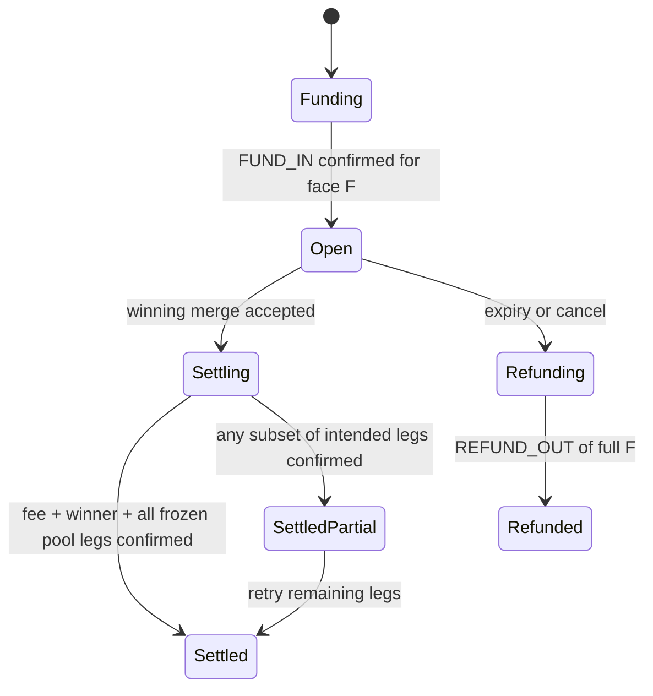

# ADR 0003: V2 multi-hunter participation pool

- **Status:** Proposed — product rules frozen by LB PM (Enrique delegated). Engineering acceptance on this PR promotes the ADR to **Accepted**.
- **Date:** 2026-09-12
- **Product:** GitHub Bounties (not Lightning Bounties / LB1 / “Lightning Bounties 2”)
- **Tickets:** [docs/v2-tickets.md](../v2-tickets.md) (V2-0…V2-5)
- **Follows:** [ADR 0001](./0001-cdp-x402-wallets.md) (fee/custody), [ADR 0002](./0002-x402-exact-dev-fund.md) (DEV x402 `exact` Lock)
- **Supersedes:** ADR 0001 V2 sketch (`pool ≈ 0.15 × F`). Frozen math is **15% of post-fee**, not 15% of face.
- **This PR:** plan and docs only. **Do not implement V2 here.**

> **Proposed** — rules below are the PM freeze. No schema migration, webhook worker,
> multi-payee settle, or UI ships in this PR. V1.5 WalletConnect + amount chips is
> parallel polish after x402 [#29](https://github.com/jegamboafuentes/github-bounties/pull/29)
> and **does not block** this spec.

## Context

V1 pays a single winner: the author of the merged pull request that closes funded
issue `#N`. Settlement (ADR 0001 / V1-5) is two transfers from `gb-escrow`:

```
fee_atomic    = floor(F × 200 / 10_000)   // 2% of face → gb-fee
hunter_atomic = F − fee_atomic            // 98% → winner
```

V1 also ships an exclusive **72h claim-lock** (coordination only; no USDC). That
lock serializes hunters and is the wrong product shape for a participation pool.

LB PM froze V2 multi-hunter rules. This ADR is the engineering lock so tickets
match those rules exactly. ADR 0001’s one-line V2 sketch (`pool ≈ 0.15 × F`) is
**wrong** under the freeze and must not be implemented.

### What stays from V1

| Lock | Unchanged |
| --- | --- |
| Winner | Author of the merged PR that closes funded `#N` |
| Fee | **2% of face**, at settlement only, to `gb-fee` |
| Rail | CDP server wallets + x402 USDC on Base (Sepolia on DEV). Inbound Lock is ADR 0002 `exact`. |
| Refund / cancel | Full face `F` to funder; **no** fee, **no** pool |
| Hosted checkout | Still disabled (ADR 0001 fee-skim open Q) |
| Identity | Google session + `github_links`; BYO Base address |

## Decision

**Equal participation pool among eligible non-winner hunters. Drop exclusive
claim-lock. Multi-payee settle of fee + winner + N pool transfers.**

### 1. Pool eligibility (frozen)

A GitHub user is **pool-eligible** for bounty `#N` iff **all** of:

1. They are **not** the winner (merged PR author who closes `#N`).
2. They are **not** the bounty poster (`bounties.poster_user_id` → linked GitHub identity).
3. They **opened ≥ 1 pull request** that **references** funded issue `#N`.
4. That PR’s `created_at` is **strictly before** the winning merge (`pull_request.merged_at`).
5. That same qualifying PR has **≥ 1 commit authored by them** (see [Force-push](#force-push)).

“References `#N`” is **broader than V1 winner closing keywords**. A PR references
`#N` if any of the following hold against **this** repository:

| Surface | Counts |
| --- | --- |
| Closing keywords (`close[s|d]`, `fix[es|ed]`, `resolve[s|d]`) in title, body, commits | Yes |
| Non-closing mention: `Refs #N`, `Related to #N`, `See #N`, or `#N` in the PR title | Yes |
| Development sidebar / GraphQL `closingIssuesReferences` | Yes |
| Cross-repo `owner/other#N` | **No** (same rule as V1) |
| `Duplicate of #N` only | **No** |

Same-repo `owner/repo#N` and issue URLs count. Known GitHub negation false-positive
(`must NOT close #N`) still matches — do not rely on negation.

One hunter with many PRs: use the **earliest qualifying** PR (`min(created_at)`).
That timestamp is the cap-rank key.

### 2. Split (frozen)

Let `E` be the eligible set after exclusions.

| Case | Money |
| --- | --- |
| `\|E\| = 0` | Winner receives **100% of post-fee** (`F − fee`). Empty-pool regression. |
| `1 ≤ \|E\| ≤ 10` | Equal split of the pool among `E`. |
| `\|E\| > 10` | Cap **10**, earliest by first qualifying PR `created_at`. Overflow is recorded, not paid. |

Ties on `created_at`: `pr_number ASC`, then `github_id ASC`. Deterministic; no
lottery.

### 3. Claim-lock sunset (frozen)

**Drop exclusive 72h claim-lock in V2.** Hunters work in parallel.

- Do not acquire a new exclusive `claim_locks` row for V2 bounties.
- Board must not show “Claimed by X until …” as an exclusive lock.
- Optional, **non-blocking** “working on this” signal only (many hunters may signal
  the same bounty). Signal **never** moves USDC and **never** changes eligibility.
- V1 expiry cron may drain residual exclusive locks, then retire.

### 4. Math (frozen)

Let `F` be face in USDC atomic units (10⁻⁶ USDC). Fee **always** from face:

```
fee_atomic      = floor(F × 200 / 10_000)              // 2% → gb-fee
post_fee        = F − fee_atomic                       // 98%
pool_atomic     = |E| = 0 ? 0 : floor(post_fee × 1500 / 10_000)   // 15% of 98%
winner_atomic   = post_fee − pool_atomic               // 85% of 98%, or 100% if empty
N               = min(|E|, 10)
share_atomic    = N = 0 ? 0 : floor(pool_atomic / N)   // equal
dust_atomic     = pool_atomic − share_atomic × N       // → winner (pool stays equal)
```

Approximations the PM quoted: winner ≈ **0.833F**, pool ≈ **0.147F**.
Exact identities: `0.85 × 0.98 = 0.833`, `0.15 × 0.98 = 0.147`.

`bounties.participation_pool_bps` (V1 nullable stub) means **1500 bps of
post-fee**, not of face. Do not store `1500` as “15% of F”.

Worked example, `F = 100.000000` USDC, `N = 2`:

| Leg | Atomic | USDC |
| --- | ---: | ---: |
| Face | 100_000_000 | 100.000000 |
| Fee → `gb-fee` | 2_000_000 | 2.000000 |
| Winner | 83_300_000 | 83.300000 |
| Pool total | 14_700_000 | 14.700000 |
| Each pool hunter | 7_350_000 | 7.350000 |

Conservation: `fee + winner + N × share + dust = F`. Dust is always `< N` atomic
units and is assigned to the **winner** so every pool member receives the same amount.

### Winner

Unchanged from V1: **merged PR author** (`pull_request.user`) whose PR closes `#N`
into the repository default branch. Claim-lock holder (V1) is irrelevant. Signal
set (V2) is irrelevant.

## Edge cases (engineering lock)

These are in scope for tickets. PM reviews them against the freeze.

### Ties

Two hunters with the identical first-qualifying-PR `created_at` (GitHub second
precision can collide): sort `pr_number ASC`, then `github_id ASC`, then apply
the max-10 cut. Document the sort in code comments and fixtures. No “both get
in and N=11”.

### Late PRs

A PR with `created_at >= winning_merge.merged_at` is **not** qualifying, even if
it references `#N` and has their commits. Opening a PR after the winning merge
cannot mint a pool share.

Commits pushed onto an **already-open** qualifying PR **after** `merged_at` do
**not** create eligibility that did not exist at freeze. Commit check is a
snapshot at winning merge (see force-push).

### Force-push

Evaluate `GET …/pulls/{n}/commits` (or the equivalent GraphQL) **at freeze time**
(winning merge), not live HEAD later.

| History | Eligible? |
| --- | --- |
| Their commit present on the PR at freeze | Yes (if other rules hold) |
| They force-pushed away every commit of theirs **before** freeze | No |
| They force-pushed after freeze | Ignore; snapshot already frozen |
| PR is empty / only someone else’s commits | No |
| Co-author trailer on someone else’s commit, they never opened a qualifying PR | No |

We do **not** walk reflog or recover force-pushed SHAs. Snapshot is truth.

### Draft PRs

**Drafts count.** Frozen rules say “opened ≥ 1 PR”, and GitHub `draft: true`
PRs are opened PRs. `converted_to_draft` / `ready_for_review` do not change
`created_at`. A draft that references `#N` and has their commit is qualifying.

### Cross-fork

A PR whose `head` repo is a **fork** and whose `base` is the bounty repository
**counts**. That is a normal GitHub contribution.

A PR opened against a **different** repository (cross-repo `Fixes other/repo#N`)
does **not** count for this bounty.

### Claim-lock sunset

| V1 | V2 |
| --- | --- |
| One active exclusive lock / bounty | Zero exclusive locks |
| `claim_locked` bounty status | Stay `funded` until settle (or reuse status only as a legacy drain) |
| 72h expiry restores `funded` | No exclusivity to expire |
| Best-effort `bounty-claimed` label | Do not imply exclusivity; optional signal comment is fine |
| Lock holder ≠ winner (already true) | Same: signals ≠ winner ≠ pool |

Migration: on V2 flag / deploy, expire or `released` any `claim_locks.status=active`.
Do not pay the lock holder. New table `work_signals` (many rows per bounty) for
the optional signal. Do not reuse the exclusive unique index.

### Settlement idempotency

V1 keys are deterministic per `(bounty_id, kind)` (`gb-v1-5:…` in
`moneyIdempotencyKey`). V2 has **1 + N + 1** money legs (winner, each pool
member, fee). Each leg needs its **own** long-lived key.

```
FEE_OUT          (bounty_id, FEE_OUT)
WINNER_PAYOUT    (bounty_id, WINNER_PAYOUT)          // rename conceptually from HUNTER_PAYOUT
POOL_PAYOUT      (bounty_id, POOL_PAYOUT, participant_id)
```

Rules:

1. Insert allocation-ledger rows `pending` with UUID/idempotency keys **before**
   the first CDP transfer.
2. Pass that key as `X-Idempotency-Key`. Our ledger outlives CDP’s ~24h window
   (same as ADR 0001).
3. Duplicate merge webhook / double Claim / retry: second caller no-ops legs
   that already have `tx_hash` or `submitted`/`confirmed`.
4. **Never reverse** a confirmed transfer to “fix” another leg. `SettledPartial`
   until every intended leg is confirmed (or a zero-amount empty-pool skip).
5. Unlinked GitHub identity or missing BYO address: that **pool** leg stays
   retryable (`settled_partial`). Do **not** redistribute their share. The equal
   split was frozen among `E`, not among whoever has a wallet today.
6. Empty pool (`|E|=0`): single winner transfer of `post_fee` + `FEE_OUT`. No
   `POOL_PAYOUT` rows. This is the empty-pool regression.
7. Refund/cancel before settle: `REFUND_OUT` of full `F`. Delete or void unused
   pending allocation rows; never `FEE_OUT` / pool / winner.

Winner-leg failure before a hash stays `settling` + `fail_code` (V1-5 behavior).
Any confirmed leg + any failed/unsent intended leg = `settled_partial`.

### Other edges (explicit)

| Case | Lock |
| --- | --- |
| Poster is also the winner | Winner gets winner share (or 100% if `E` empty). Poster never enters `E`. |
| Winner also opened earlier PRs | Excluded as winner; those PRs do not mint a pool share. |
| Co-authors on the **winning** PR only | Not in `E` unless they opened their **own** qualifying PR. |
| Closed / unmerged qualifying PR | Still counts (opened + reference + their commit). |
| Reopened PR | `created_at` stays the original open time. |
| Bot / `type=Bot` (Dependabot, etc.) | **Not eligible.** Not in the PM freeze; engineering exclude. |
| Hunter not in `github_links` at merge | Persist eligibility by `github_id` / login. Claim/settle retries after Connect (same spirit as V1 `hunter_not_linked`). |
| One winning PR closes multiple funded issues | Evaluate `E` **per bounty**. |
| Bounty not `funded` (or V1 `claim_locked`) at merge | No winner claim, no pool (V1 skip `no_funded_bounty`). |
| GitHub App / user disconnect after freeze | Allocation stays; payout waits for a linked wallet. |

## Sequences

### Parallel hunt → freeze on winning merge

```mermaid
sequenceDiagram
  autonumber
  actor H1 as Hunter A
  actor H2 as Hunter B
  actor W as Winner
  participant GH as GitHub
  participant App as GitHub Bounties
  participant DB as pool_participants

  H1->>GH: Open PR #11 Refs #N (draft OK)
  GH->>App: pull_request opened
  App->>DB: candidate A (not frozen)
  H2->>GH: Open fork PR #12 Fixes #N + own commit
  GH->>App: pull_request opened
  App->>DB: candidate B
  W->>GH: Open + merge PR #13 Closes #N
  GH->>App: pull_request closed merged=true
  App->>App: Winner = W; snapshot commits; drop poster/winner/late/bots
  App->>DB: freeze E (max 10 by created_at); write claims eligible
  Note over App,DB: Signals ignored. Exclusive claim-lock not acquired.
```

### Multi-payee settle

```mermaid
sequenceDiagram
  autonumber
  actor Hunter as Winner (Claim)
  participant App as settleEscrow V2
  participant Led as allocation_ledger
  participant Escrow as gb-escrow
  participant Chain as Base Sepolia

  Hunter->>App: Claim / settle
  App->>Led: insert FEE_OUT, WINNER_PAYOUT, POOL_PAYOUT×N pending
  App->>Escrow: fee_atomic → gb-fee (idempotent)
  App->>Escrow: winner_atomic + dust → winner
  loop each frozen pool member with wallet
    App->>Escrow: share_atomic → member
  end
  alt any intended leg missing tx
    App->>Led: SettledPartial; retry remaining keys only
  else all confirmed
    App->>Led: Settled; fee_ledger row
  end
  Note over Chain: Empty E → winner gets post_fee; no POOL_PAYOUT rows.
```

## State machine (delta from ADR 0001)



`ClaimLocked` is **not** a V2 money/coordination state. Residual V1
`claim_locked` rows drain to `funded` on deploy, then the exclusive path is
removed from UI.

## Schema sketch (implement in V2-1, not this PR)

V1 already has nullable `bounties.participation_pool_bps` /
`participation_pool_usdc`. V2 fills those at fund (bps = 1500 of post-fee;
usdc computed at settle when `N` is known).

New tables (names indicative):

```text
work_signals
  id, bounty_id, user_id, signaled_at, cleared_at
  -- many per bounty; no exclusive unique

pool_participants
  id, bounty_id
  github_id, github_login
  user_id                  -- nullable until github_links
  role                     -- winner | pool | overflow | excluded_poster | excluded_bot
  qualifying_pr_number
  qualifying_pr_created_at
  qualifying_pr_url
  commit_sha               -- one commit of theirs at freeze
  frozen_at
  share_usdc               -- equal share; 0 for overflow/excluded
  payout_address, payout_tx_hash, paid_at
  skip_reason
  unique (bounty_id, github_id)

allocation_ledger
  id, bounty_id, participant_id|null
  kind                     -- FEE_OUT | WINNER_PAYOUT | POOL_PAYOUT
  amount_atomic, to_address
  idempotency_key          -- unique
  tx_hash, status          -- pending | submitted | confirmed | failed
  unique (bounty_id, kind, participant_id)
```

`escrows.payout_tx_hash` remains the **winner** hash for V1 readers. Pool hashes
live on `allocation_ledger` / `pool_participants`. Do not overload a single
column for N transfers.

`claims` stays the **winner** eligibility row (V1-3/V1-6). Pool members are not
`claims` rows.

## Ledger invariant

After confirmed money movement:

```
sum(FUND_IN + SWEEP_IN)
  − sum(WINNER_PAYOUT + POOL_PAYOUT + FEE_OUT + REFUND_OUT)
  = USDC still attributed to this bounty in gb-escrow
```

Terminal `Settled` / `Refunded`: attributed = 0.
Open: attributed = F.
`SettledPartial`: attributed = not-yet-sent intended legs.

Nightly recon unchanged in spirit: `sum(open attributed) == gb-escrow` USDC
(allow in-flight `submitted`).

## Alternatives considered

| Alternative | Verdict |
| --- | --- |
| ADR 0001 sketch `pool ≈ 0.15 × F` (then winner `F − fee − pool`) | **Rejected.** PM freeze is 15% of **post-fee**. |
| Keep exclusive 72h lock; pool among people who “would have claimed” | **Rejected.** Lock dropped; parallel hunt. |
| Redistribute unlinked members’ shares at settle | **Rejected.** Split freezes with `E`. Retry the leg. |
| Pool includes winner (winner gets 85% + a share) | **Rejected.** Winner is excluded from `E`. |
| Require ready-for-review (no drafts) | **Rejected** unless PM reopens. Freeze says opened PR. |
| Pay co-authors of the winning PR | **Rejected.** Own qualifying PR required. |
| Smart-contract split / Merkle drop | Out of scope. Same CDP `transferUsdc` rail, N+2 times. |
| Implement V2 in this PR | **Rejected.** Plan/docs only. |

## Non-goals (this PR and V2-adjacent polish)

- **Any V2 implementation code** (schema, settle, webhooks, UI) in this PR
- V1.5 **WalletConnect + amount chips** — parallel polish after x402 [#29](https://github.com/jegamboafuentes/github-bounties/pull/29); **not blocking** this spec
- Hosted Coinbase Business checkout
- Mainnet USDC / production user funds
- Changing the 2% face fee or the winner definition
- Lightning / multi-rail / custodial hunter wallets
- Dispute window / agent marketplace

## Consequences

**Positive**

- Tickets can be reviewed line-by-line against the PM freeze.
- Empty-pool path is an explicit regression of V1 (winner gets 98%).
- Exclusive lock cannot starve parallel hunters.
- ADR 0001 fee-at-settlement and full-face refunds still hold.

**Negative / follow-ups**

- `settleEscrow` becomes N+2 transfers; `SettledPartial` is more common.
- Merge-time GitHub commit listing needs App `pull_requests` + `contents` (already
  V1-3) and likely `opened` / `synchronize` subscriptions for live roster UX.
- Unlinked eligible hunters leave USDC in escrow until they Connect + set a wallet.
- Residual V1 claim-lock UI/cron must be retired without breaking in-flight DEV bounties.

## Done criteria (product, after implementation tickets — not this PR)

1. **≥ 2 hunters dogfood on DEV** (`https://dev.githubbounties.xyz`): parallel
   qualifying PRs, one winning merge, both see the pool roster.
2. **Pool payouts on-chain** (Base Sepolia): winner + each frozen pool member +
   `gb-fee` have confirmed transfers that sum to `F`.
3. **Empty-pool regression:** a funded bounty whose `E` is empty pays **100% of
   post-fee** to the winner (V1 amount), fee 2% to `gb-fee`, zero `POOL_PAYOUT`.

## Spike / tickets

Ordered workstreams, acceptance criteria, and fixture list:
[docs/v2-tickets.md](../v2-tickets.md).
